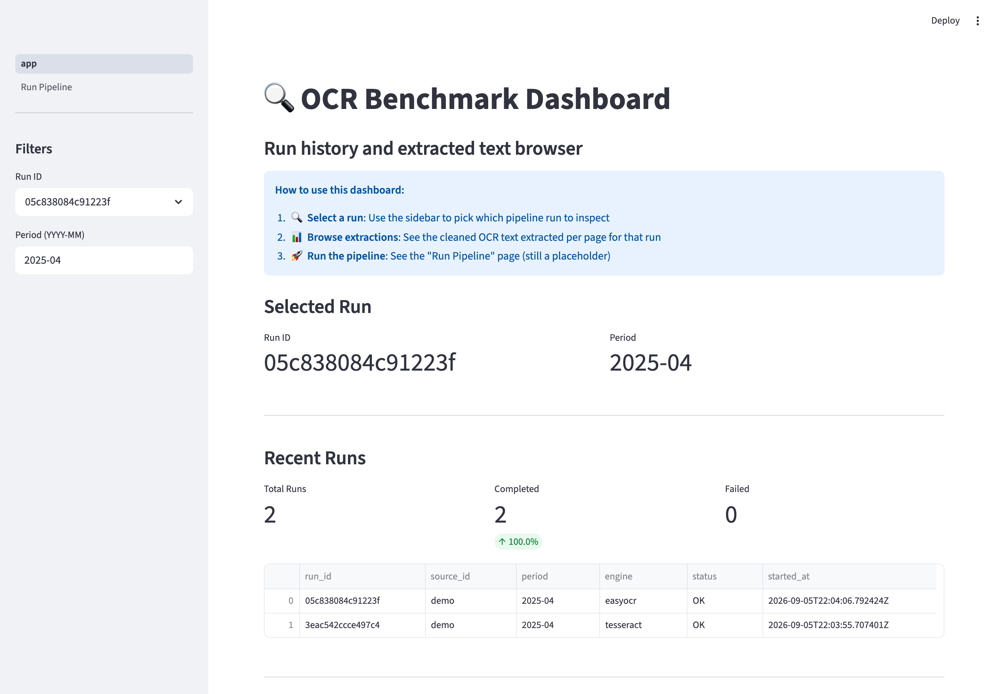
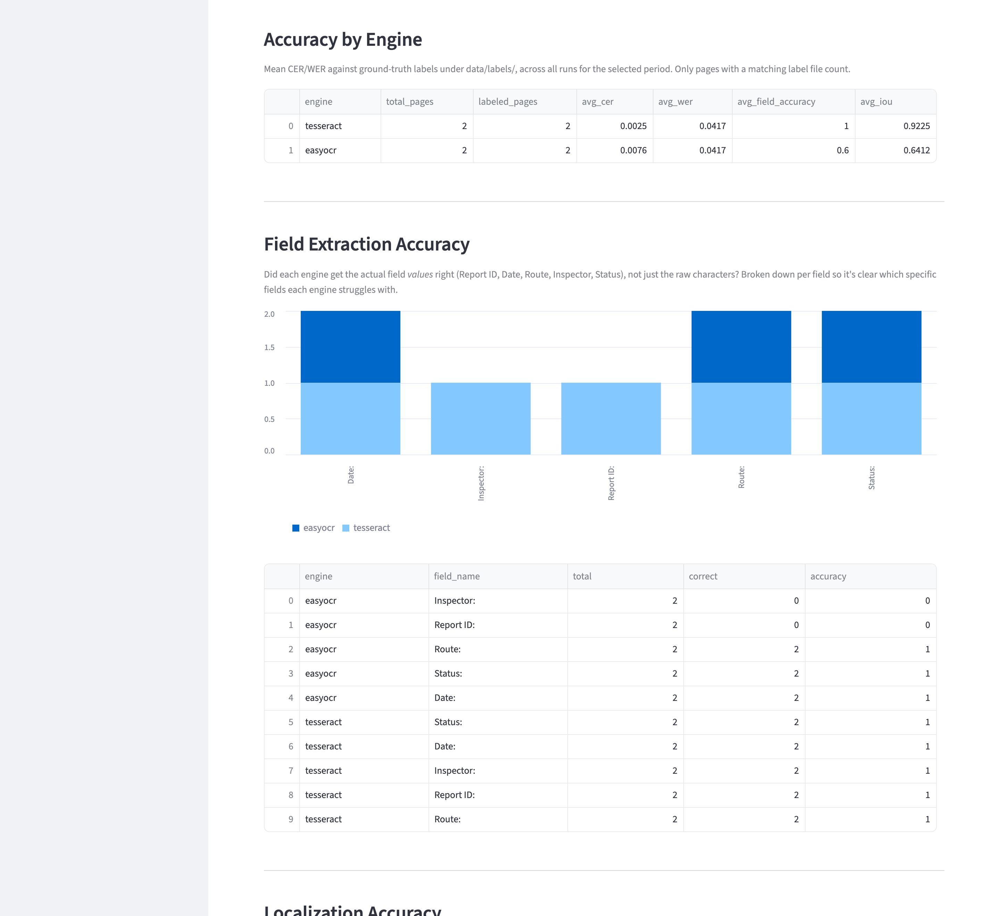
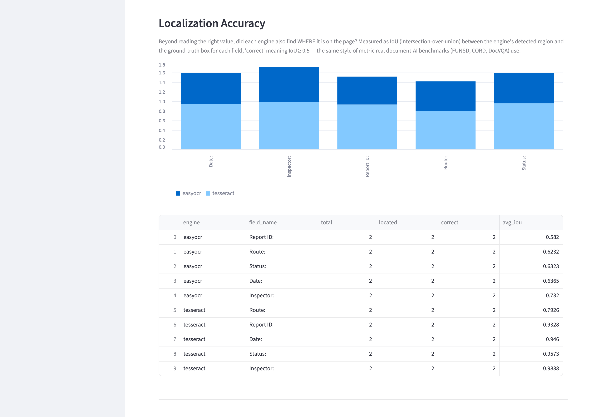
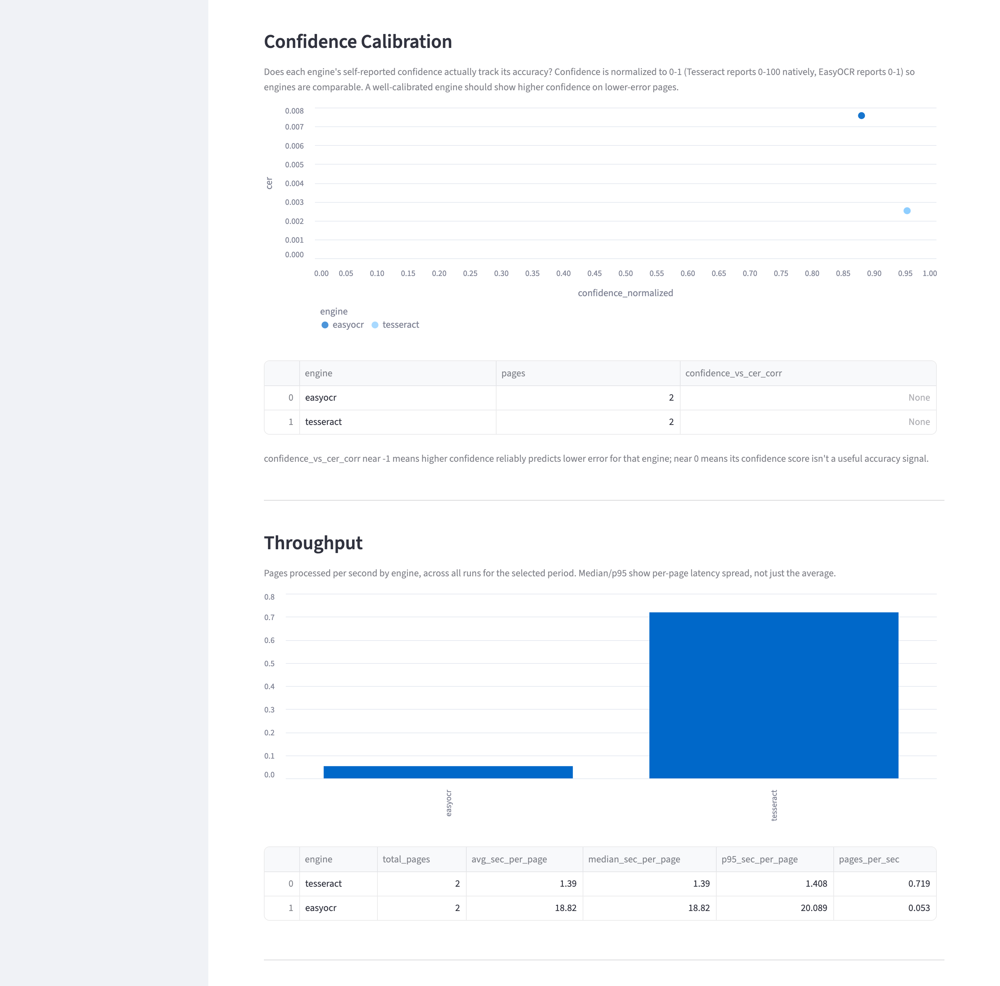
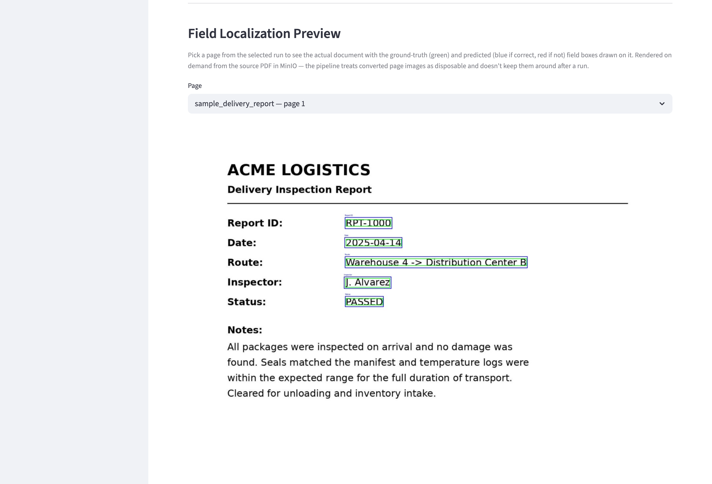

# OCR Benchmark Pipeline & Dashboard

This project provides a fully containerized pipeline for benchmarking OCR engines against scanned documents, plus a web dashboard for browsing the results.

It automates the whole workflow:
1.  **Ingestion**: Downloads PDFs from a MinIO object store.
2.  **Processing**: Converts PDF pages into PNG images.
3.  **OCR extraction**: Runs a selected OCR engine (e.g. Tesseract, PaddleOCR, EasyOCR) on the images.
4.  **Storage**: Saves structured run metadata to PostgreSQL and raw JSON output to MongoDB.
5.  **API**: Exposes a FastAPI backend for querying all results.
6.  **Analysis & visualization**: Provides a Streamlit dashboard for browsing runs and extracted text.

---

## Screenshots

**Run history and accuracy-by-engine**, computed automatically once ground-truth labels exist for a document:



**Field-extraction accuracy** — did each engine get the actual field *values* right (not just raw characters), broken down per field:



**Localization accuracy** — did each engine also find *where* each field is on the page, measured as IoU against ground-truth boxes:



**Confidence calibration and throughput** — does each engine's self-reported confidence actually track its accuracy, and how fast is it:



**Field localization preview** — ground-truth (green) and predicted (blue/red) boxes rendered on the actual source page, on demand from MinIO:



---

## 1 · Architecture

The whole system is orchestrated with Docker Compose and made up of the following services:

-   **`app`**: The main Python container where pipeline tasks run.
-   **`api`**: A FastAPI backend that serves data from the databases.
-   **`streamlit`**: A web-based dashboard for interactive browsing.
-   **`postgres`**: A PostgreSQL database storing structured pipeline-run metadata.
-   **`mongo`**: A MongoDB database storing raw, unstructured OCR JSON output.
-   **`minio`**: An S3-compatible object store for input PDFs.

The design here is deliberately pluggable: adding a new OCR engine means implementing one small interface (`BaseOCREngine`) and registering it — the rest of the pipeline (conversion, benchmarking, storage, API, dashboard) is engine-agnostic. See [§6](#6--adding-a-new-ocr-engine).

---

## 2 · Try It Out (Sample Data)

A synthetic sample document ships with the repo at `data/pdf/2025-04/sample-report/`, so you can run the whole pipeline without any external data or services:

```bash
# 1. Install dependencies with uv (see https://docs.astral.sh/uv/ if you don't have it)
uv sync   # or use ./setup_local_dev.sh

# 2. Run the pipeline end-to-end against the sample PDF
uv run python run_local_pipeline.py --step all --engine tesseract --input data/pdf/2025-04/sample-report

# 3. Check the result
cat results/tesseract/sample-report/extracted_text.txt
```

This requires the `tesseract` and `poppler` (for `pdftoppm`) system binaries — see [§3](#3--setup--installation) for install instructions, or use Docker to get them for free.

The sample document was generated with `scripts/data_prep/generate_sample_data.py`, which you can also use to produce more (or different) synthetic pages for testing.

---

## 3 · Setup & Installation

### Docker-Based Setup

For full-stack development with all services:

### Prerequisites

-   Docker and Docker Compose
-   Copy the example env files and adjust as needed:
    ```bash
    cp env.common.example .env.common
    cp env.local.example .env.local
    cp env.api.local.example .env.api.local
    ```

### Running the System

The whole stack can be started with a single command:

```bash
make docker-up
```

This starts all services in the background. You can then access:

-   **Streamlit dashboard**: `http://localhost:8501`
-   **FastAPI backend**: `http://localhost:8080`
-   **MinIO console**: `http://localhost:9001`

### Native/Local Development (No Docker)

For lightweight development focused on OCR processing, without any databases:

```bash
# Set up the local environment (creates .venv/ via uv, installs pre-commit
# hooks, writes .env.local)
./setup_local_dev.sh

# Load local env vars
export $(cat .env.local | xargs)

# Run the local pipeline
uv run python run_local_pipeline.py --step all --engine tesseract
```

`uv run` picks up `.venv/` automatically -- no activation needed. If you'd
rather activate it directly, `source .venv/bin/activate` works too.

`setup_local_dev.sh` also runs `pre-commit install`, so `ruff`/`black` (plus
a few basic hygiene checks) run automatically on `git commit`. Run them on
demand with `uv run pre-commit run --all-files`.

**Local development features:**
- **No Docker required**: Runs Python directly
- **No databases**: File-based processing only
- **Fast iteration**: Quickly test OCR engines and preprocessing logic
- **Minimal dependencies**: Only core OCR functionality

---

## 4 · Usage

### Streamlit Dashboard (Main Interface)

The primary way to interact with the system is the Streamlit dashboard.

Navigate to `http://localhost:8501` to:

-   **Browse runs**: See run history and status.
-   **Explore extracted text**: Browse the cleaned OCR text extracted per page for a given run.

### Running the Pipeline via CLI

You can run the pipeline from the command line in two ways: a **fully automated pipeline**, or **manual step-by-step execution**.

#### Full Pipeline (Recommended)

**Default Run (Tesseract)**
```bash
# Runs the full pipeline: download → convert → OCR → extract → publish
make run
```

**Run with a Specific Engine**
```bash
# 'engine' must match a config file under configs/engines/
make run ENGINE=paddleocr
```

**Offline Mode**
```bash
# First, download PDFs from MinIO to local storage
make download

# Then run the full pipeline offline using the downloaded PDFs
make run ENGINE=tesseract OFFLINE=1
```

`make run` automatically runs the whole pipeline:
1. **Download**: Fetches PDFs from MinIO (skipped if offline)
2. **Convert**: Turns PDFs into PNG images
3. **OCR**: Processes images with the selected engine
4. **Extract**: Cleans OCR text and stores it per page
5. **Publish**: Saves results to PostgreSQL/MongoDB (skipped if offline)

#### Manual Step-by-Step Execution

For development or troubleshooting, you can run individual pipeline steps:

```bash
# 1. Interactively download PDFs from MinIO
make download

# 2. Convert PDFs to images (requires SUBFOLDER=<folder_name>)
make convert SUBFOLDER=<document_folder>

# 3. Run OCR on converted images
make ocr ENGINE=tesseract MONTH=2025-04

# 4. Clean OCR output and store extracted text
make extract ENGINE=tesseract MONTH=2025-04
```

**Offline Mode Details:**
- **Pre-download**: Use `make download` to interactively select and download PDFs from MinIO
- **File layout**: Downloads to `data/pdf/<period>/<document>/` automatically
- **No connectivity**: Pipeline runs without any MinIO or database connections
- **Local processing**: All conversion, OCR, and extraction happen locally
- **Source prompt**: You'll be asked for a source identifier for run metadata

#### Native Python Development (No Docker)

For pure local development without any services:

```bash
# One-time setup
./setup_local_dev.sh
export $(cat .env.local | xargs)

# Put PDFs under data/pdf/<period>/<document>/
mkdir -p data/pdf/2025-04/document1
# Copy your PDFs here

# Run the full pipeline
uv run python run_local_pipeline.py --step all --engine tesseract

# Or run individual steps
uv run python run_local_pipeline.py --step convert --input data/pdf/2025-04/document1
uv run python run_local_pipeline.py --step ocr --engine tesseract
uv run python run_local_pipeline.py --step extract --engine tesseract
```

**Benefits of native development:**
- **Faster iteration**: No container startup time
- **Direct debugging**: Use your IDE's debugger directly
- **Minimal footprint**: No Docker overhead
- **File-based**: Results saved as local JSON/text files

#### MinIO → Offline Workflow

To connect to MinIO, download PDFs, and then run fully offline:

```bash
# 1. Set up the local environment (one time)
./setup_local_dev.sh
export $(cat .env.local | xargs)

# 2. Set MinIO credentials in .env.prod:
#    MINIO_ENDPOINT=your.server:9050
#    MINIO_ACCESS_KEY=your_access_key
#    MINIO_SECRET_KEY=your_secret_key

# 3. Download PDFs from MinIO (interactive selection)
PYTHONPATH=$(pwd) uv run python scripts/data_prep/download_pdfs_from_minio.py

# 4. Run the pipeline offline using the downloaded PDFs
uv run python run_local_pipeline.py --step all --engine tesseract
```

**This workflow:**
1. **Connects to MinIO** using credentials from `.env.prod`
2. **Interactive selection** of source → period → document folders
3. **Downloads PDFs** into the `data/pdf/<period>/<document>/` layout
4. **Processes locally**, with no Docker containers or database connections
5. **Saves results** as JSON/text files under `results/`

Great for: **grabbing the latest PDFs from cloud storage + fast local development**

Outputs are saved under the `results/<engine-name>/` directory.

---

## 5 · Accuracy Metrics & Ground Truth

Beyond timing and self-reported confidence, the pipeline measures actual
correctness against ground truth: character/word error rate (CER/WER) on
raw OCR text, and field-extraction accuracy on named values (Report ID,
Date, Route, ...). Both are computed automatically whenever a matching
label file exists, and simply skipped (left `NULL`) when one doesn't.

### Where ground truth comes from (important: not from OCR)

Ground truth can't come from reading the same document you're trying to
OCR — that would be circular. Instead it lives in separate label files
under `data/labels/<document>/`:

-   `<document>_<page>.txt` — the exact text expected on that page (CER/WER).
-   `<document>_<page>.fields.json` — the exact `{label: value}` pairs
    expected on that page (field-extraction accuracy), e.g.
    `{"Report ID:": "RPT-1000", "Date:": "2025-04-14", ...}`.

**For the shipped sample document**, these labels are generated for free.
`scripts/data_prep/generate_sample_data.py` builds the sample PDF by
*drawing* known strings onto a blank image with PIL — the Python string
`"RPT-1000"` exists in memory before a single pixel is drawn. The
generator writes that same string straight to the label files at
generation time, so the labels are guaranteed to match what's on the page,
with zero OCR involved:

```
Python string "RPT-1000" ──draws pixels──▶ PDF ──rasterize──▶ PNG
        │                                                       │
        └──────────────▶ data/labels/.../*.fields.json          │
                                   │                             ▼
                                   │                   Tesseract/EasyOCR
                                   │                   reads the PIXELS
                                   │                   (no access to the
                                   │                   original string)
                                   ▼                             │
                         field_accuracy() compares  ◀────────────┘
                         these two independent strings
```

**For real (non-synthetic) documents, this trick doesn't apply.** There's
no shortcut: label files have to come from a human reading the actual
document and typing the correct values, or from an already-verified
external system of record (e.g. the shipment database the report was
generated from) — never from OCR-ing the document again. The pipeline
doesn't care where a label file came from, only that it exists; just drop
`.txt`/`.fields.json` files under `data/labels/<document>/` matching the
`<document>_<page>` naming used by `convert_pdfs_to_images.py`, and both
metrics activate automatically on the next run.

### CER/WER (`src/evaluate/metrics.py`)

Character Error Rate and Word Error Rate (via `jiwer`) between the raw OCR
text and the `.txt` label — a low-level measure of text fidelity.

### Field-extraction accuracy (`src/evaluate/field_extraction.py`)

A higher-level, business-relevant measure: did the engine get the actual
*values* right, not just the characters? Two runs can have near-identical
CER/WER and very different real-world usefulness if the one character
error lands inside a date or an ID. `extract_fields()` scans the engine's
raw text for each expected label and takes the rest of that line as the
value (no layout assumptions — works on any engine's output, so it applies
to future engines with no interface changes); `field_accuracy()` compares
that against the `.fields.json` label (whitespace/case-normalized) and
reports both a per-page summary and a per-field breakdown (which specific
fields an engine tends to get wrong).

### Where to see it

-   **Dashboard** (`http://localhost:8501`): "Accuracy by Engine", "Field
    Extraction Accuracy" (per-field breakdown chart), and "Page Accuracy"
    sections.
-   **API**: `GET /records/accuracy-summary`, `GET /records/field-accuracy`,
    `GET /records/runs/{run_id}/page-metrics`.
-   **Storage**: `ocr_page_metrics` (per-page `cer`/`wer`/`field_accuracy`
    summary) and `ocr_field_results` (per-field detail) in PostgreSQL — see
    `scripts/db/pg_ddl.sql`.

---

## 6 · Adding a New OCR Engine

To add support for a new OCR engine, follow these three steps:

1.  **Add a config**: Create a new config file for your engine under `configs/engines/`, e.g. `myengine.yaml`. The filename (without extension) becomes the engine's identifier.

2.  **Implement the class**: Create a new Python file under `src/ocr_engines/`, e.g. `myengine_engine.py`. Implement your engine's class, which **must** inherit from `BaseOCREngine` and implement the `predict` method.

    ```python
    # src/ocr_engines/myengine_engine.py
    from .base_engine import BaseOCREngine

    class MyEngine(BaseOCREngine):
        def __init__(self, config: dict):
            super().__init__(config)
            # Your engine's initialization logic here

        def predict(self, image_path: str) -> dict:
            # Your prediction logic here
            return {"text": "extracted text", "confidence": 0.95, "engine": "MyEngine"}
    ```

3.  **Register the engine**: Add a loader for your new engine to `ENGINE_LOADERS` in `src/ocr_engines/utils.py`. Each loader imports its engine's class lazily, so an engine's dependencies (e.g. EasyOCR's `torch`) are only pulled in when that engine is actually used.

    ```python
    # src/ocr_engines/utils.py
    def _load_myengine_engine():
        from src.ocr_engines.myengine_engine import MyEngine

        return MyEngine

    ENGINE_LOADERS = {
        "tesseract": _load_tesseract_engine,
        "easyocr": _load_easyocr_engine,
        "myengine": _load_myengine_engine,  # Add it to the dict
    }
    ```

After following these steps, you can run the pipeline with your new engine:

```bash
make run ENGINE=myengine
```

---

## 7 · Developer Commands (`Makefile`)

The `Makefile` provides convenient shortcuts for common tasks.

| Command | Description |
| :--- | :--- |
| **Lifecycle** | |
| `make docker-up` | Start all services defined in `docker-compose.yml`. |
| `make docker-down` | Stop and remove all running containers. |
| `make build` / `rebuild` | Build or rebuild the main `app` Docker image. |
| `make app-sh` | Get an interactive `bash` shell inside the `app` container. |
| **Code Quality** | |
| `make dev-setup` | Auto-format (`black`) and lint (`ruff`) the code. |
| `make format` | Run the code formatter. |
| `make lint` | Run lint checks and static analysis. |
| **Pipeline** | |
| `make run ENGINE=... [OFFLINE=1]` | Run the whole OCR pipeline with a specific engine. |
| `make download` | Interactively download PDFs from MinIO. |
| `make convert SUBFOLDER=...` | Convert PDFs to images (manual step). |
| `make ocr ENGINE=... MONTH=...` | Run only the OCR extraction step. |
| `make extract ENGINE=... MONTH=...` | Clean raw OCR JSON output into tabular form. |
| **Database** | |
| `make pg-ddl` | Apply the initial SQL schema to the PostgreSQL database. |
| `make pg-load RUN_ID=...` | Load CSVs into PostgreSQL for a specific run ID. |
| `make insert` | Upsert OCR JSONs from the `results` directory into MongoDB. |

For a full list of commands and their parameters, see the `Makefile`.
